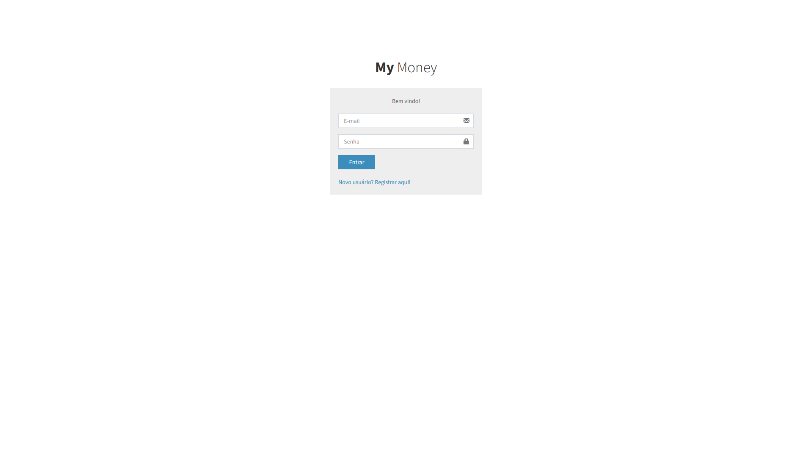
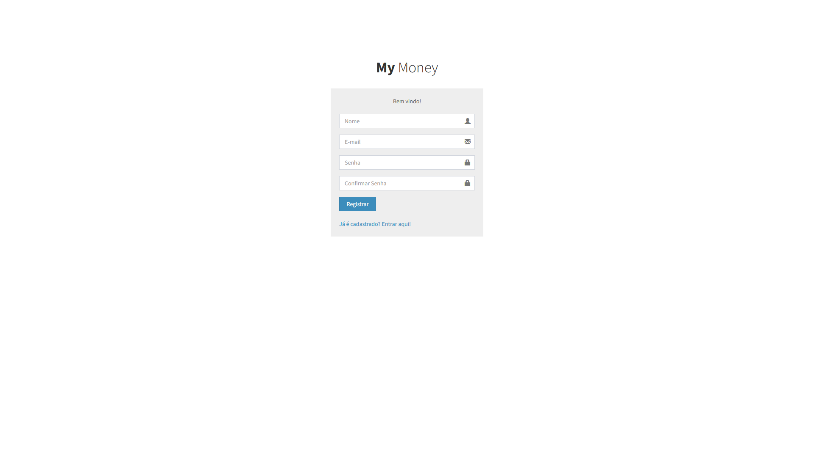
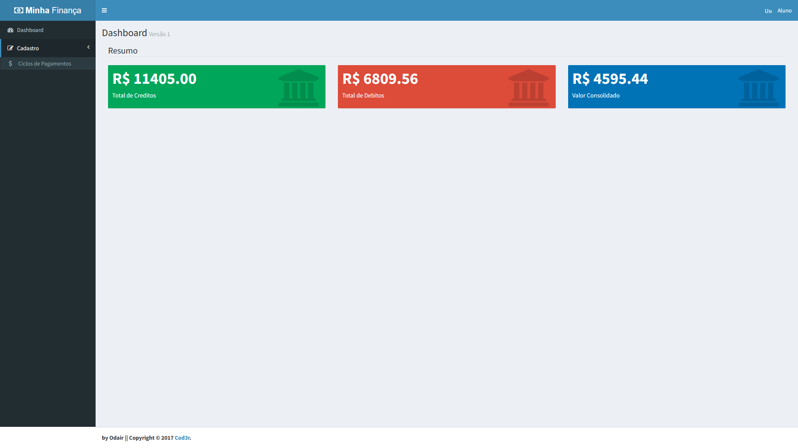
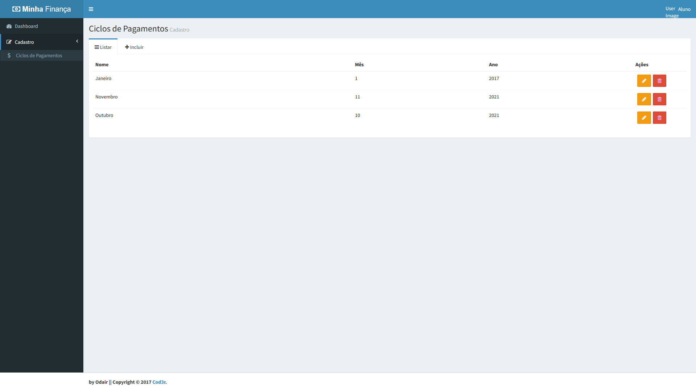
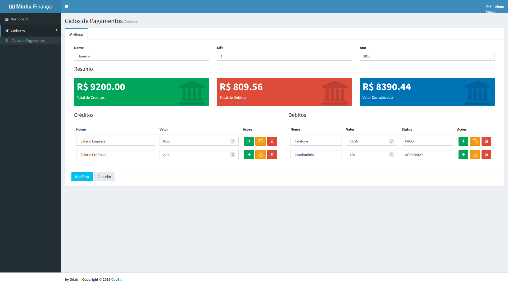

# Minhas Finanças

Aplicativo criado para gerenciar finanças pessoas ou empresariais de facil acesso e sem custo

## Tecnologias, linguagens e bibliotecas usadas

## Inicialização:
Antes de tudo instale as dependencias na computador, basta ir até as pastas frontend e backend, abrir o cmd e digitar:
<CODE>npm i</CODE>
ou
<CODE>npm install</CODE>

Agora com as dependencias instaladas, abra digite no cmd:
<CODE>mongod </CODE>
Isso iniciará o mongoDB em sua maquina

Abra pasta do backend e de o comando:
<CODE>npm run dev</CODE>
Isso iniciará a API para fornecer as funções para a frontend

Abra por fim a pasta frontend e faça o mesmo comando:
<CODE>npm run dev</CODE>
Pronto o projeto esta funcinando perfeitamente.

